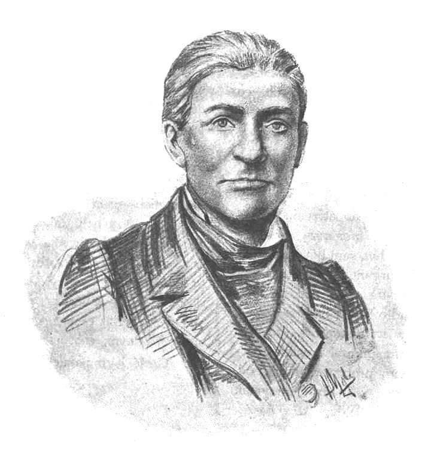

**Franciszek Armiński (1789-1846)**  

- 2.10.1789 Tymbark - narodziny
- 1792 - przenosiny do Śleszowic
- 1808 - wyjazd do Krakowa
- 1808 - wyjazd do Warszawy
- 1811 - wyjazd do Paryża
- 1815 - powrót do kraju
- 1817-1831 - profesor Uniwersytetu Warszawskieg
- 1825 otwarcie obserwatorium
- 1827 szkic o historii astronomii
- 1828 i 1829 obserwacje na Łysicy
- 1830 Connossance des temps
- 14.01.1846 Śmierć w Warszawie

Rodziców stracił w niemowlęctwie, wychowywał go najpierw wuj [^a],
następnie znalazł dla siebie miejsce w klasztorze pijarów w Krakowie, gdzie ukończył szkoły.  
W Krakowie rozpoczął studia filozoficzne i matematyczne, lecz po roku przeniósł się do Warszawy.  
Pozostając domownikiem kasztelana Aleksandra Linowskiego, rozwijał zainteresowania matematyczne pod kierunkiem Jana Joachima Liveta, profesora Szkoły Aplikacyjnej Artylerii i Inżynierów.  
Pod koniec 1811 udał się do Paryża.
Rozpoczął tam studia matematyczne i astronomiczne, najpierw na własny koszt, a od 2.09.1814 jako stypendysta władz oświatowych Księstwa Warszawskiego.
Zetknął się m.in. z Jean-Baptist J. Delambreem i Frangois Arago.  
Powrócił do Warszawy w poł. 1815, po drodze odwiedzając obserwatoria astronomiczne w Anglii i na południu Europy.  
W Warszawie powierzono mu początkowo wykłady matematyki w Liceum Warszawskim i Kolegium O.O. Pijarów.
Jesienią 1815, wykorzystując pobyt Aleksandra I w Warszawie, wystąpił do niego o fundusze na zakup instrumentów astronomicznych,
Na początku 1816 udał się do Monachium, gdzie w renomowanej firmie Reichenbacha zamówił wielkie koła południkowe i repetycyjne.  
28.09.1816 powierzono mu katedrę astronomii w tworzonym Uniwersytecie Warszawskim;
wykładał tu od jesieni 1817 do zamknięcia uczelni w 1831.
Na jego barki złożono także utworzenie Obserwatorium Astronomicznego w Warszawie.  
Prace budowlane rozpoczęto w kwietniu 1820 na terenie Ogrodu Botanicznego, o czym przesądziła opinia Jana Śniadeckiego.
Według Armińskiego lokalizacja ta znajdowała się za blisko miasta.
Formalne przejęcie przez uniwersytet ukończonego pół roku wcześniej budynku nastąpiło 18.08.1825.
Był odpowiedzialny za odpowiednie ustawienie w gmachu instrumentów południkowych
Reichenbacha, jak również doposażenie placówki przyrządami drobniejszymi (m.in. teleskop Fraunhofera o średnicy 10 cm oraz, z pracowni Reichenbacha, heliometr, wielki ekwatoriał, przenośne koło repetycyjne i instrument przejściowy), zegarami z warszawskiej pracowni Antoniego Gugenmusa oraz instrumentami meteorologicznymi — systematyczne wieloletnie spostrzeżenia tymi ostatnimi rozpoczęto 20.11.1825.
W l. 1824-1825 pod jego kierunkiem ustawiano instrumenty w niedużym obserwatorium
astronomicznym, ulokowanym w ośmiokątnej wieży konwiktu pijarów na Żoliborzu.
W l. 1826-1828 wyznaczył po raz pierwszy współrzędne geograficzne Obserwatorium Astronomicznego w Warszawie.
Prace te, kontynuowane do 1842 z udziałem Jana Baranowskiego i Adama Prażmowskiego, posłużyły za podstawę dwóch publikacji w „Connaissance des temps” w 1846. W 1. 1828-1829 na zlecenie Komisji Rządowej Przychodów i Skarbu przeprowadził pomiary astronomiczno-geodezyjne na Łysicy i w okolicach; zrelacjonował je w 1830 w „Pamiętniku Sandomierskim”.
Jest autorem szkicu historycznego o astronomii starożytnej, ogłoszonego drukiem w 1827 w Rocznikach Towarzystwa Warszawskiego Królewskiego Przyjaciół Nauk.

Od 1967 jego imię nosi krater na widocznej stronie Księżyca.
[^a]: J. Bełza, Opis biegu życia Franciszka Armińskiego, założyciela i dyrektora obserwatoryum astronomicznego warszawskiego
